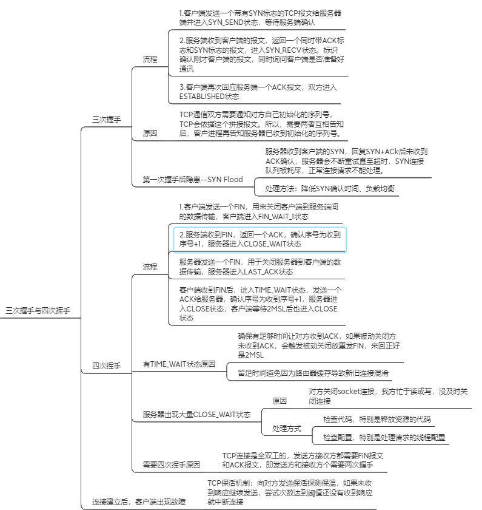

问题：什么是Web，什么是HTML，CSS，JavaScript
我的理解：
web建立在HTTP协议基础上，利用浏览器进行访问的网站，传输主体是超文本，流量开销小。而Internet不止包含Web，还包含FTP,P2P,Email等方式。
HTML为超文本标记语言，最新标准是HTML5，严格版本XHTML。HTML会将超文本标记不同的标签唯一标识。
CSS指层叠样式表(Cascading Style Sheets)，可将多个样式保存在一个文件中，可通过渲染时加载外部样式表，实现内容与表现分离，想采用新的渲染方式只需更新外部样式表即可。
JavaScript标准是ECMAScript，是一种解释性脚本语言，可用于向HTML页面添加交互行为，像css一样可嵌入HTML也可单独形成文件，单独的js文件有利于结构和行为的分离

其他与浏览器相关的知识总结：
问：浏览器输入网址后，浏览器做了什么
我的理解：浏览器先对网址进行补全，然后查找该域名的IP地址，发送HTTP请求报文，与对方服务器发生三次握手后建立连接，四次握手断开连接。
中间连接建立后，浏览器向服务器发送封装好的请求报文，服务器收到请求并返回响应，浏览器解析响应头并开始显示页面，但响应中传过来的是页面框架，浏览器还会对页面上的静态资源发起多次请求
[具体中间涉及的技术需要详细描述，整个回答也需要]

上述流程涉及的知识点：
1. 如何查找域名的IP地址
我的理解：查询IP地址的过程也成为DNS解析，即将域名解析为IP地址。浏览器首先检索浏览器缓存，没找到再检索操作系统缓存，再路由器缓存，还没找到会发送请求给本地域名服务器
(该DNS服务器提供本地互联网接入的一个DNS解析服务)。再之后有两种查找方式（递归查询、迭代查询）。
递归查询：如果主机询问的本地域名服务器不知道查询的域名对应的IP地址，则本地域名服务器会以DNS客户的身份，向其他域名服务器继续发出请求报文，返回查询结果(没找到则报错)。
迭代查询：当根域名服务器收到本地域名服务器发出的迭代查询请求报文时，要么给出所要查询的IP地址，要么告诉本地服务器：“你下一步应当向哪一个域名服务器进行查询”。然后让本地服务器进行后续的查询。根域名服务器通常是把自己知道的顶级域名服务器的IP地址告诉本地域名服务器，让本地域名服务器再向顶级域名服务器查询。顶级域名服务器在收到本地域名服务器的查询请求后，要么给出所要查询的IP地址，要么告诉本地服务器下一步应当向哪一个权限域名服务器进行查询。最后，知道了所要解析的IP地址或报错，然后把这个结果返回给发起查询的主机。

2. 三次握手与四次挥手

3. TCP与UDP区别
相同点：TCP与UDP都是传输层协议，基于IP协议
不同点：
（面向连接或无连接）TCP面向连接，UDP面向无连接。所以UDP适合消息的多播发布
（可靠性）TCP利用握手、确认、重传机制确保可靠性，UDP数据包可能丢失。
（顺序）TCP利用三次握手时确认的序列号保证消息按顺序交付，UDP不保证，但我们可以将传输控制交给应用层。
（速度）TCP报文头部较大，传的较慢，UDP较小更适合对传输速度敏感的应用

4. 如何理解TCP是有连接有状态协议，而HTTP无连接无状态又分短连接长连接
HTTP属于应用层协议，在传输层使用TCP协议，在网络层使用IP协议。
无连接指每次连接只处理一个请求，处理完成断开连接。无状态指每个请求都是相互独立的。
当浏览器向服务器发除HTTP请求时，HTTP会通过TCP建立一个连接通道，数据传输完成HTTP会将TCP断开。
HTTP1.0默认短连接，初步支持长连接，HTTP1.1后默认长连接，通过设置Keep-Alive但需要客户端服务端都支持长连接。
HTTP的长短连接，实质上是TCP的长短连接，实现在HTTP外，从HTTP自身看还是无连接的。
HTTP本身无状态，需要使用状态时，可通过cookie和session实现

5. sessions与cookies区别
cookie存储在浏览器中对客户端可见，session存储在服务端对客户端透明，所以session更安全
cookie限制了存储数据量，session无限制，但考虑服务器性能，需要加以限制
cookie只能保存ASCII字符串，并存储为Unicode字符或二进制数据，session能存储任何类型的数据
浏览器支持
  如果客户端禁用或不支持cookie，要使用session还需要使用URL重写，否则会失效。因为session是通过Session ID确定当前对话对应的服务器Session，而Session ID通过cookie传递。
  如果客户端支持cookie，cookie既能设置为本窗口及子窗口有校，也能设置为一切窗口有效，session只在本窗口及子窗口有效。

6. HTTP报文与TCP/UDP报文结构

7. HTTP各版本差异

8. 常用HTTP响应的状态码
1XX：指示信息--标识请求已接收，继续处理
2XX：成功--标识请求已被成功处理
3XX：重定向--要完成请求必须进行进一步的操作
4XX：客户端错误--请求有语法错误或请求无法实现
5XX：服务器端错误--服务器未能实现合法的请求

9. json与xml在哪里被使用
在客户端服务端需要一种双方认可的格式传输并存储数据，json和xml指定数据的结构，按约定写入/读取即可完成数据的传输与存储。

参考网址：

[1] https://www.runoob.com/html/html-intro.html

[2] https://baike.baidu.com/item/javascript/321142?fr=aladdin

[3] https://blog.csdn.net/kongmin_123/article/details/82555936

[4] http://www.360doc.com/content/13/0527/17/11253639_288596772.shtml

[5] https://blog.csdn.net/yipiankongbai/article/details/25031461

[6] https://www.jianshu.com/p/2f7031a69f43

[7] https://blog.csdn.net/rao1255165570/article/details/84312827

[8] https://blog.csdn.net/weixin_34130389/article/details/92326225

[9] http://ife.baidu.com/note/detail/id/146
